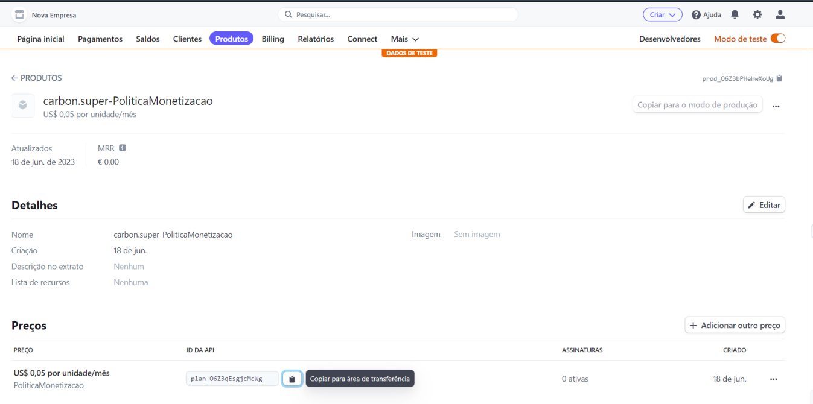

# ACME API Documentation

## Monetization Policies

The ACME API implements monetization policies to determine the pricing and billing 
rules for API usage. 
These policies enable the API provider to charge users based on their API consumption,
such as the number of requests made or the volume of data transferred.

As seen in the images below, the group implemented a Monetization Policy called "PoliticaMonetizacao" to
gate the api usage to paying customers only.

That being said, the policy charges 0.05 cents per request and has a limit of 5000 requests
per minute, at a burst request max of 800 requests per second.

## Authorization Policies

Authorization policies are in place to ensure secure access to the ACME API. 
These policies control who can access specific resources and perform certain 
actions within the API. Through the implementation of authorization policies, 
the API provider can enforce authentication, role-based access control (RBAC), 
or other access control mechanisms. Users or client applications are required to 
provide valid credentials or tokens to authenticate and authorize their requests to 
the API.

## Throttling Policies

Throttling policies are implemented to control the rate of requests made to 
the ACME API. These policies help prevent abuse, protect the API infrastructure 
from overload, and ensure fair usage among different users or client applications. 
Throttling policies can define limits on the number of requests per second, 
per minute, or per day, based on factors such as API key, user account, or 
IP address. When the request rate exceeds the defined limits, the API may respond 
with a throttling error or delay the processing of additional requests.

## Monitorization Policies

For Monitoring, the team used Choreo. The documentation mentions API Analytics but 
upon further investigation we soon realized it was deprecated and the best 
alternative was in fact Choreo.

